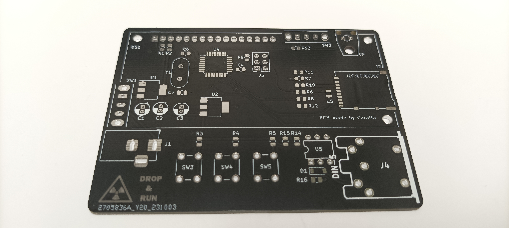
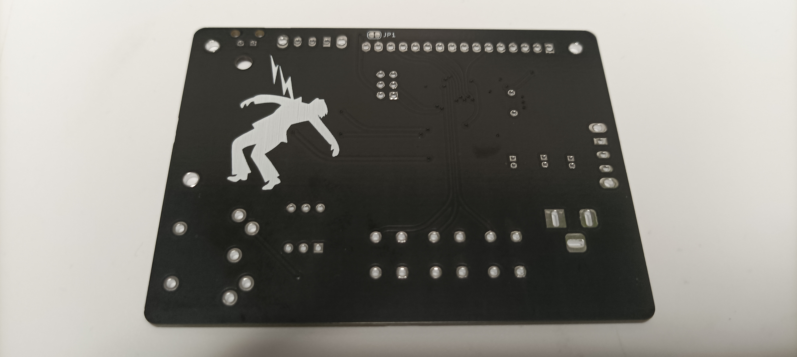
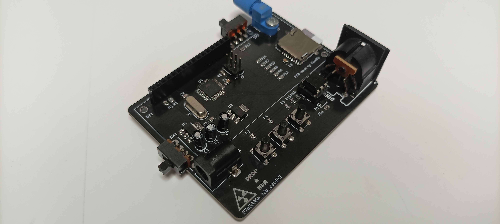
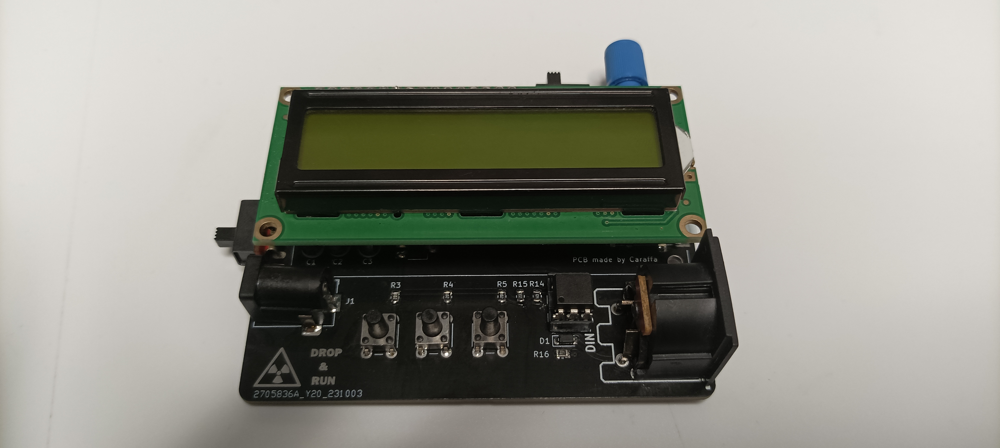

# Tesla coil MIDI interrupter
It's modified version of [OneTesla SD interrupter](https://onetesla.com/).
To compile original software you have to install [SdFat v1.1.4](https://github.com/greiman/SdFat/releases/tag/1.1.4) library.

